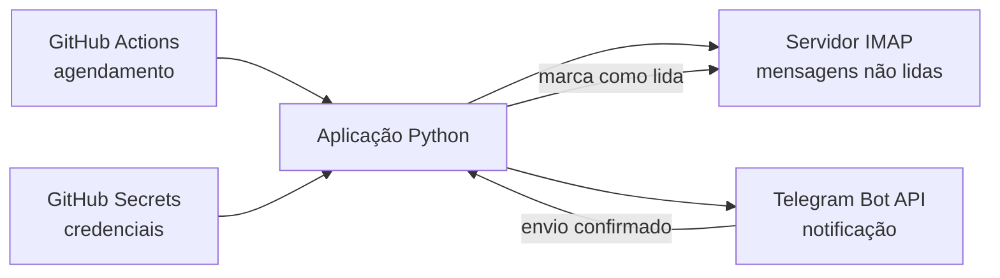

# Telegram Bot Email

[](https://github.com/marcosantoniotic/telegram-bot-email/actions/workflows/ci.yml)
[](https://www.python.org/)
[](https://github.com/features/actions)

Automação serverless em Python que monitora mensagens não lidas por IMAP e envia
notificações ao Telegram. O projeto usa GitHub Actions para execução agendada,
GitHub Secrets para credenciais e testes automatizados para validar mudanças.

## Visão geral

O projeto resolve uma necessidade operacional simples: receber alertas de novos
e-mails sem manter um servidor dedicado. A mensagem só é marcada como lida depois
que o Telegram confirma o envio, reduzindo o risco de perda silenciosa de
notificações.



## Competências demonstradas

- automação operacional com Python e GitHub Actions;
- integração com IMAP e API HTTP;
- gestão segura de credenciais com GitHub Secrets;
- tratamento de exceções, timeouts e falhas parciais;
- processamento de cabeçalhos MIME e caracteres acentuados;
- princípio de menor privilégio no workflow;
- testes unitários e integração contínua;
- documentação técnica e versionamento com Git.

## Confiabilidade e segurança

- valida as variáveis obrigatórias antes de iniciar;
- não grava tokens ou senhas no código;
- usa timeout nas conexões externas;
- verifica erros retornados pela API do Telegram;
- mantém a mensagem como não lida quando a notificação falha;
- isola falhas para que uma mensagem problemática não interrompa as demais;
- evita registrar credenciais e conteúdo completo dos e-mails nos logs;
- limita o token do workflow a `contents: read`.

> **Privacidade:** remetente e assunto são enviados ao chat configurado. Use um chat
> privado e avalie a política de dados aplicável ao ambiente.

## Tecnologias

| Área | Tecnologia |
| --- | --- |
| Linguagem | Python 3.11 |
| E-mail | IMAP |
| Mensageria | Telegram Bot API |
| Automação | GitHub Actions |
| Cliente HTTP | Requests |
| Testes | unittest |

## Configuração

Cadastre os seguintes **Actions secrets** em **Settings > Secrets and variables >
Actions**:

| Secret | Finalidade |
| --- | --- |
| `EMAIL_USER` | Conta de e-mail consultada |
| `EMAIL_PASS` | Senha de aplicativo ou credencial IMAP |
| `TELEGRAM_TOKEN` | Token do bot no Telegram |
| `TELEGRAM_CHAT_ID` | Identificador do chat de destino |

O servidor padrão é `imap.gmail.com`. Para outro provedor, defina a variável
opcional `IMAP_HOST` no ambiente de execução.

## Execução

O workflow de produção pode ser iniciado manualmente na aba **Actions** e também
é agendado a cada cinco minutos, o menor intervalo aceito pelo GitHub Actions.

Para executar localmente:

```powershell
python -m pip install -r requirements.txt
$env:EMAIL_USER = "conta@example.com"
$env:EMAIL_PASS = "senha-de-aplicativo"
$env:TELEGRAM_TOKEN = "token"
$env:TELEGRAM_CHAT_ID = "chat-id"
python bot_email.py
```

## Testes

```powershell
python -m unittest discover -v
python -m py_compile bot_email.py
```

O workflow de CI executa essas validações automaticamente em pushes e Pull
Requests direcionados à `main`.

## Estrutura

```text
.
├── .github/workflows/
│   ├── ci.yml
│   └── run-bot.yml
├── tests/
│   └── test_bot_email.py
├── bot_email.py
└── requirements.txt
```

## Autor

**Marcos Antonio Nepomuceno Alves**

Infraestrutura, Redes, Sistemas Operacionais, Virtualização e Cloud

- [GitHub](https://github.com/marcosantoniotic)
- [LinkedIn](https://www.linkedin.com/in/marcosantoniotic)

Nunca inclua credenciais reais em commits, logs ou capturas de tela.
